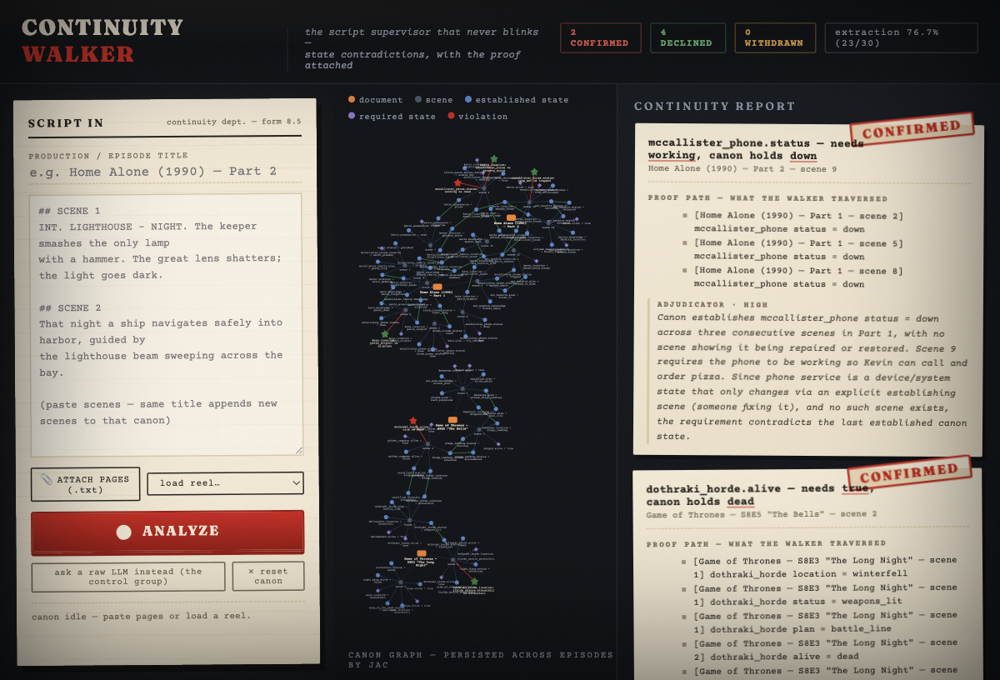

# Continuity Walker

**Finds provable plot holes in movie and TV scripts.** Built in
[Jac](https://github.com/jaseci-labs/jac) at JacHacks SF 2026.

## The idea

Every scene both **establishes** facts and **requires** facts. A plot hole is a
scene requiring something the accumulated canon graph doesn't support.

We only claim **state contradictions** — an object/person/system is established
in state X, a later scene requires state Y, and no transition exists in
between. That's objective and provable: the walker's traversal path *is* the
proof. (Subjective "why didn't they just…" logic holes are explicitly out of
scope.)

Paste a screenplay into a raw LLM and ask for plot holes: you get five
confident answers, three hallucinated, and a different five next run. Our
output comes with the exact chain of scenes that makes it true.

## How it works (all in Jac)

1. **Extract** — one byLLM call per scene returns typed
   `establishes[] / requires[]` fact triples (subject, predicate, value).
2. **Accrete** — facts attach to a persistent canon graph (Jac's built-in
   persistence — canon survives across runs and across episodes, zero DB code).
3. **Audit** — the `Auditor` walker checks each requirement against the most
   recent canon state for that subject+predicate, hunting for a reconciling
   transition.
4. **Adjudicate** — only mismatches get a second byLLM call, which kills false
   positives (and powers the live "withdraw the finding" demo).

## Run it



**The UI** (paste a script, or load a sample reel, and hit ANALYZE — the HTTP
server itself is written in Jac):

```sh
pip install jaclang byllm         # plus OPENROUTER_API_KEY or GEMINI_API_KEY
jac run main.jac serve            # → http://localhost:8765
```

**The CLI**, same engine:

```sh
jac run main.jac ingest data/home_alone_ep1.txt
jac run main.jac ingest data/home_alone_ep2.txt
jac run main.jac audit            # → the Home Alone phone-line plot hole
jac run main.jac canon            # inspect accumulated canon
jac run main.jac score            # extraction accuracy vs annotated key facts
jac run main.jac ingest data/home_alone_amendment.txt   # the fan defense
jac run main.jac audit            # → watch the finding get withdrawn
jac run main.jac naive data/home_alone_ep1.txt data/home_alone_ep2.txt
                                  # → the control group: a raw LLM's answer
```

`./demo.sh prep|find|naive|amend|score|serve` drives the whole demo arc.

**Teammates: don't re-index.** The extracted canon ships in the repo as
`canon_share.json` (facts + cached verdicts, no transcript prose). After
cloning:

```sh
jac run main.jac import canon_share.json   # full canon, zero LLM calls, no keys
jac run main.jac serve                     # → http://localhost:8765
```

Re-exporting after new ingests: `jac run main.jac export canon_share.json`
(add `prose` as a third arg to include scene text — don't commit that for
copyrighted transcripts). You only need API keys to ingest *new* scenes.

**Real documents:** `.docx` transcripts ingest directly — `Scene N:` headings
are recognized, headingless transcripts are auto-chunked, and
`jac run main.jac convert <src.docx> <out.txt> "<Title>"` writes a reusable
reel. Films that share a story world declare `# CANON: <scope>` so episodes
and prequels share canon while unrelated films stay isolated.

`CW_BACKEND=claude` routes extraction/adjudication through the `claude` CLI
(`claude -p`) instead of byllm — runs on a Claude subscription with no API
key at all (`CW_CLI_MODEL` for extraction, default haiku;
`CW_CLI_JUDGE_MODEL` for verdicts, default sonnet).
`CW_NO_LLM=1` runs the graph pipeline on annotated facts only (no API calls).
`CW_MODEL` overrides the extraction model (default:
`openrouter/deepseek/deepseek-v4-flash` — ~$0.10 for a 139-scene corpus;
falls back to `gemini/gemini-2.5-flash` without an OpenRouter key), and
`CW_JUDGE_MODEL` sets the adjudicator separately.

Scene files are plain text: `## SCENE n` headers + prose. Optional `@expect`
lines are *not* shown to the LLM — they're ground truth used to score
extraction accuracy.
